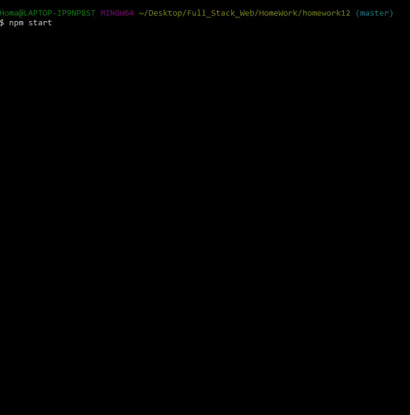
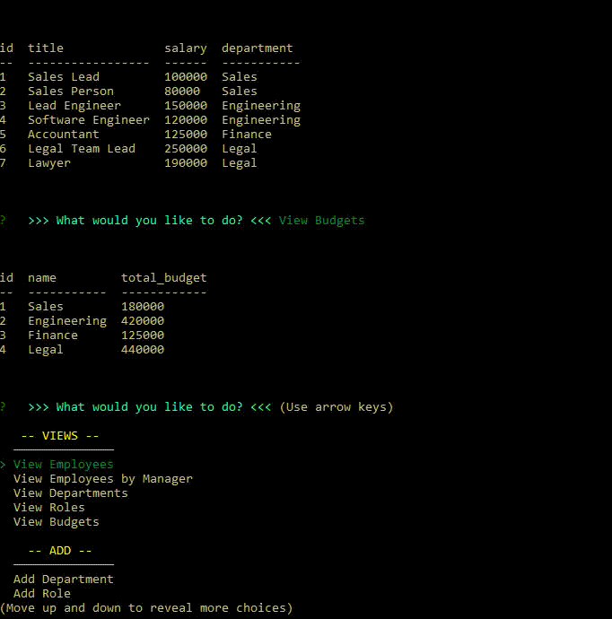
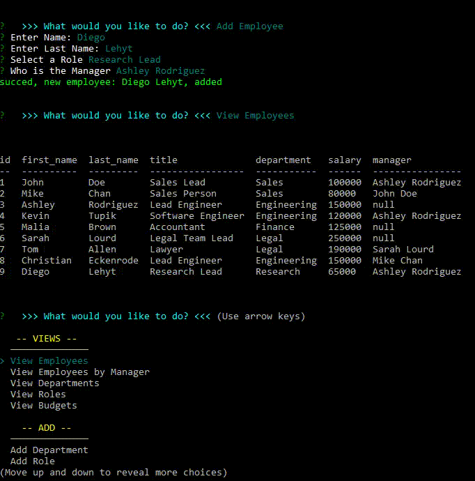
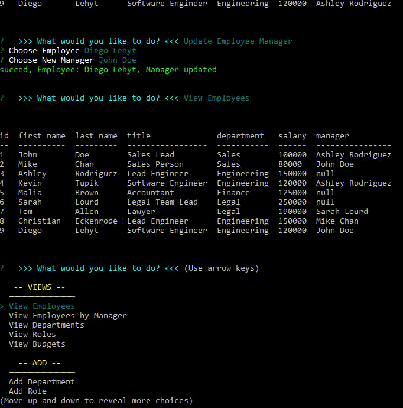
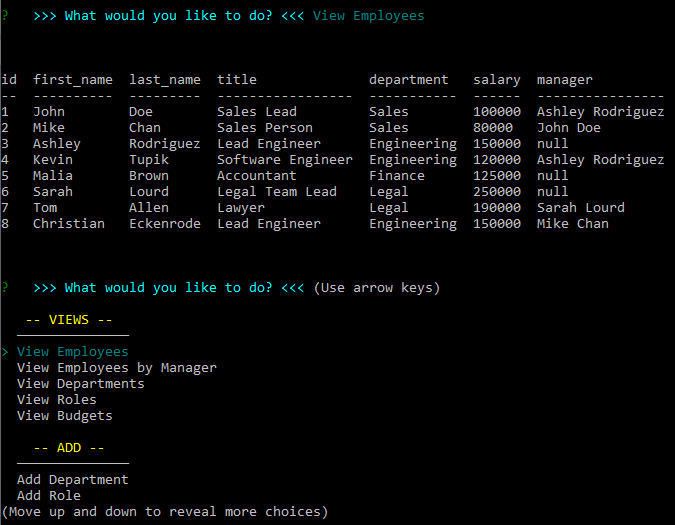
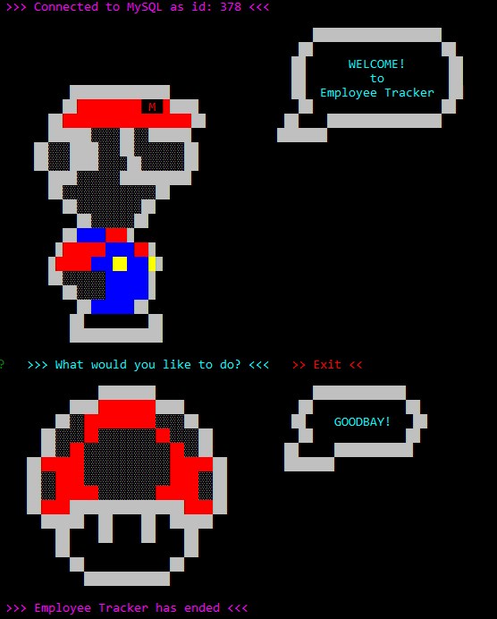

# Employee Traker      
### Homework - 12 / Employee Managment System


- Link to the Full Video Demo at the end. [>> GO ⬇️ <<](#url)


- data VIEWS



- ADD data



- UPDATE data



- DELETE data



## 📌Table of Content

* [Description](#description)
* [Installation](#installation)
* [Usage](#usage)
* [Test](#test)
* [Contributing](#contributing)
* [License](#license)
* [Details](#details)
* [Features](#features)
* [URL](#url)
* [Questions](#questions)

## 📋Description
"Employee Traker" is a CLI application that can help you keep your work team updated and organize. Powered by MySQL and javascript you can view, add, update and delete information about your employees from the database.
```
As a business owner
I want to be able to view and manage the departments, roles, and employees in my company
So that I can organize and plan my business
```
- Open the application using "command line", (recomended: GitBash).




## 💿Installation
    1. Install node.js  
    2. Clone the repository
    3. npm install

## ▶️Usage
Open the app using ```npm start``` in your terminal. Then choose as many options as you need from the Menu and when you are ready to leave, select "exit" in the app menu.  


## 📊Test
 ```
 npm run test (None).
 ```


## 🤝Contributing
Feel free to pull request and give me your suggestions if any.
          
## ⚖️License  
This project is under the MIT License.

## 📑Details

This repository content the files: JavaScript "index.js" (main app), Mit license"LICENSE.txt", "package.json", "package-lock.json",modules folder (local modules), node_modules" folder and an "assets" folder with the captures and gifs for this Readme File.

## 📀Features
- Super Mario Menu

  

## 🔗URL  

- The URL to open the repo page on your Browser is "https://diegolehyt.github.io/homework12/"
- Visit my Heroku page "https://dashboard.heroku.com/apps/mighty-eyrie-28086"
- Click on the image or the Link to open the Demo on Youtube "https://youtu.be/Cs4vzQj-H3I"

    [](https://youtu.be/Cs4vzQj-H3I)


## 👤Questions  
       


✉️ E-mail: diegolehy00@gmail.com
